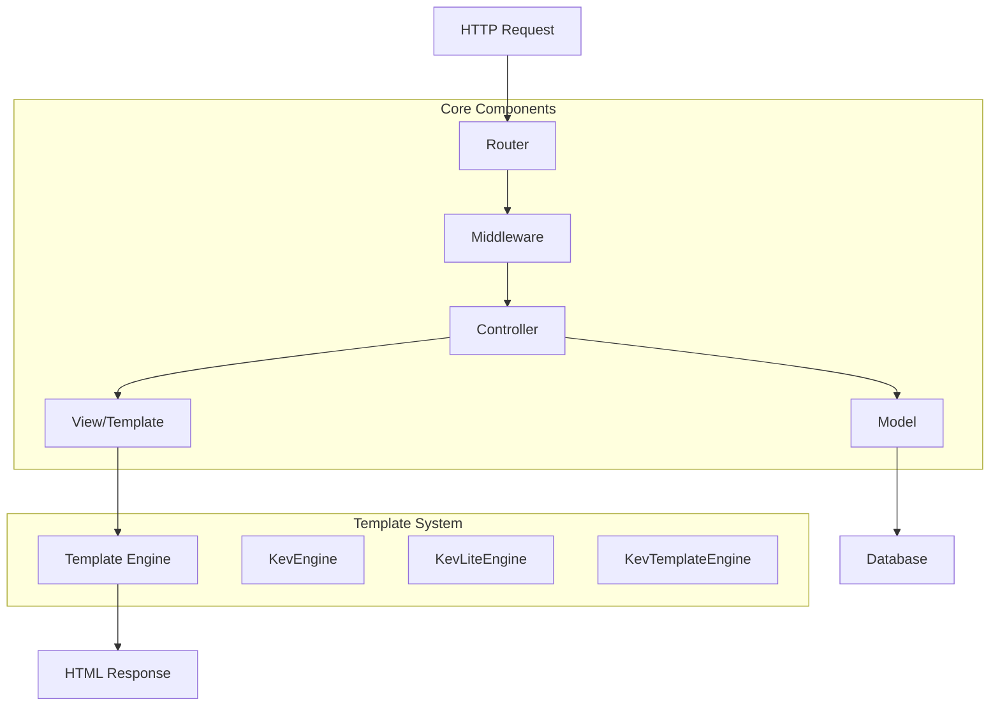

# 🔥 KevFrame - Modern PHP Framework

[]()
[](LICENSE.md)
[]()
[]()

> **KevFrame** es un framework PHP moderno, ligero y potente diseñado para el desarrollo web rápido y eficiente. Combina la simplicidad de uso con características avanzadas para crear aplicaciones web robustas.

## 📋 Tabla de Contenidos

- [✨ Características](#-características)
- [🚀 Inicio Rápido](#-inicio-rápido)
- [📁 Estructura del Proyecto](#-estructura-del-proyecto)
- [⚡ Instalación](#-instalación)
- [🔧 Configuración](#-configuración)
- [🎯 Ejemplos de Uso](#-ejemplos-de-uso)
- [🏗️ Arquitectura](#️-arquitectura)
- [📚 API Reference](#-api-reference)
- [🔧 Troubleshooting](#-troubleshooting)
- [🤝 Contribuir](#-contribuir)
- [📄 Licencia](#-licencia)

## ✨ Características

🚀 **Alto Rendimiento**
- Arquitectura MVC optimizada
- Routing eficiente y flexible
- Gestión inteligente de memoria

🎨 **Sistema de Plantillas Avanzado**
- **KevEngine**: Motor de plantillas completo
- **KevLiteEngine**: Versión ligera para proyectos pequeños
- **KevTemplateEngine**: Motor personalizable
- Sintaxis intuitiva y expresiva

🛠️ **CLI Integrado**
- Servidor de desarrollo con hot-reload
- Comandos para scaffolding
- Herramientas de debugging

📦 **Arquitectura Modular**
- Sistema de componentes reutilizables
- Interfaces bien definidas
- Inyección de dependencias

🔒 **Seguridad Integrada**
- Gestión de sesiones segura
- Protección CSRF
- Validación de datos automática

🌐 **Base de Datos**
- ORM ligero incluido
- Soporte para múltiples bases de datos
- Migrations y seeders

## 🚀 Inicio Rápido

```bash
# Clonar el proyecto
git clone https://github.com/KEVAO18/KevFrame.git
cd KevFrame

# Instalar dependencias
composer install

# Configurar entorno
cp .example.env .env

# Iniciar servidor de desarrollo
php kev serve
```

🎉 **¡Listo!** Tu aplicación estará disponible en `http://localhost:8000`

## 📁 Estructura del Proyecto

KevFrame sigue una arquitectura **MVC moderna** con separación clara de responsabilidades. Cada directorio tiene un propósito específico para mantener el código organizado y escalable.

```
KevFrame/
├── 📄 .example.env              # Configuración de ejemplo
├── 📄 .gitignore                 # Archivos ignorados por Git
├── 📄 composer.json             # Dependencias de Composer
├── 📄 kev                       # CLI del framework
├── 📄 serve.php                 # Servidor PHP nativo
│
├── 🌐 http/                     # Capa de aplicación web
│   ├── 🎮 controllers/           # Lógica de negocio
│   │   ├── ErrorController.php
│   │   └── IndexController.php
│   ├── ⚡ handlers/              # Manejadores de eventos
│   └── 🔌 interfaces/            # Contratos e interfaces
│
├── 📦 src/                      # Núcleo del framework
│   ├── ⚙️ Core/                   # Componentes principales
│   │   ├── Cli.php               # Interface de línea de comandos
│   │   ├── Database.php          # Gestión de base de datos
│   │   ├── Request.php           # Manejo de peticiones HTTP
│   │   ├── Router.php            # Sistema de rutas
│   │   ├── SessionManager.php    # Gestión de sesiones
│   │   ├── View.php              # Motor de vistas
│   │   └── routes.php            # Definición de rutas
│   │
│   ├── 🎨 Templates/             # Motores de plantillas
│   │   ├── KevEngine.php         # Motor principal
│   │   ├── KevLiteEngine.php     # Motor ligero
│   │   ├── KevTemplateEngine.php # Motor personalizable
│   │   └── TemplateEngineInterface.php
│   │
│   └── 🗺️ models/                # Modelos de datos
│
├── 🕸️ web/                      # Interfaz de usuario
│   ├── 🧩 componentes/           # Componentes reutilizables
│   │   ├── errors/               # Páginas de error
│   │   │   ├── 404.php
│   │   │   └── GeneralError.php
│   │   └── main/
│   │       └── HomeComponent.php
│   └── 🖼️ views/                  # Plantillas de vista
│       └── main.php
│
└── 🎨 public/                   # Recursos estáticos
    ├── css/                      # Hojas de estilo
    │   ├── principal.css         # Estilos principales
    │   ├── reset.css             # Reset CSS
    │   └── ...                   # Más archivos CSS
    ├── js/                       # JavaScript
    │   └── main.js
    ├── img/                      # Imágenes
    ├── docs/                     # Documentación estática
    └── runner.php                # Punto de entrada
```

### 🔍 Descripción de Componentes

#### 🎮 **Controllers** (`http/controllers/`)
> **Lógica de negocio centralizada**
- Maneja las solicitudes HTTP entrantes
- Procesa datos y coordina con modelos
- Retorna respuestas estructuradas

#### ⚡ **Handlers** (`http/handlers/`)
> **Procesamiento de eventos especializados**
- Manejo de eventos del sistema
- Middleware personalizado
- Interceptores de solicitudes

#### ⚙️ **Core** (`src/Core/`)
> **Núcleo del framework**
- **Router**: Sistema de enrutamiento avanzado
- **Database**: Abstracón de base de datos
- **SessionManager**: Gestión segura de sesiones
- **View**: Motor de renderizado de vistas
- **Request**: Manejo de peticiones HTTP

#### 🎨 **Templates** (`src/Templates/`)
> **Motores de plantillas múltiples**
- **KevEngine**: Motor completo con caché y optimizaciones
- **KevLiteEngine**: Versión minimalista para proyectos ligeros
- **KevTemplateEngine**: Motor personalizable y extensible

#### 🗺️ **Models** (`src/models/`)
> **Capa de datos**
- Representación de entidades de negocio
- Interacción con la base de datos
- Validación y transformación de datos

#### 🧩 **Componentes** (`web/componentes/`)
> **UI reutilizable**
- Componentes modulares de interfaz
- Páginas de error personalizadas
- Elementos reutilizables

## 🎯 Ejemplos de Uso

### 🔄 Creando un Controller Básico

```php
<?php
// http/controllers/UserController.php

class UserController {
    
    /**
     * Mostrar lista de usuarios
     */
    public function index() {
        $users = User::all();
        return View::render('users.index', ['users' => $users]);
    }
    
    /**
     * Mostrar formulario de creación
     */
    public function create() {
        return View::render('users.create');
    }
    
    /**
     * Guardar nuevo usuario
     */
    public function store() {
        $data = Request::validate([
            'name' => 'required|string|max:100',
            'email' => 'required|email|unique:users'
        ]);
        
        $user = User::create($data);
        
        return Response::redirect('/users')
            ->with('success', 'Usuario creado correctamente');
    }
}
```

### 🛤️ Definiendo Rutas

```php
<?php
// src/Core/routes.php

// Rutas GET
$router->get('/', 'IndexController@home');
$router->get('/users', 'UserController@index');
$router->get('/users/create', 'UserController@create');
$router->get('/users/{id}', 'UserController@show');

// Rutas POST
$router->post('/users', 'UserController@store');
$router->put('/users/{id}', 'UserController@update');
$router->delete('/users/{id}', 'UserController@destroy');

// Grupo de rutas con middleware
$router->group(['middleware' => 'auth'], function($router) {
    $router->get('/dashboard', 'DashboardController@index');
    $router->resource('/posts', 'PostController');
});

// Rutas API
$router->group(['prefix' => 'api/v1'], function($router) {
    $router->get('/users', 'Api\UserController@index');
    $router->post('/users', 'Api\UserController@store');
});
```

### 🗺️ Creando un Model

```php
<?php
// src/models/User.php

class User extends Model {
    
    protected $table = 'users';
    protected $fillable = ['name', 'email', 'password'];
    protected $hidden = ['password'];
    
    /**
     * Relación: Usuario tiene muchos posts
     */
    public function posts() {
        return $this->hasMany(Post::class);
    }
    
    /**
     * Mutador: Encriptar password
     */
    public function setPasswordAttribute($value) {
        $this->attributes['password'] = password_hash($value, PASSWORD_DEFAULT);
    }
    
    /**
     * Accessor: Nombre completo
     */
    public function getFullNameAttribute() {
        return $this->first_name . ' ' . $this->last_name;
    }
    
    /**
     * Scope: Solo usuarios activos
     */
    public function scopeActive($query) {
        return $query->where('status', 'active');
    }
}
```

### 🎨 Usando KevEngine Templates

```html
<!-- web/views/users/index.kf -->

@extends('layouts.app')

@section('title', 'Lista de Usuarios')

@section('content')
    <div class="container">
        <h1>Usuarios Registrados</h1>
        
        @if($users->count() > 0)
            <div class="user-grid">
                @foreach($users as $user)
                    <div class="user-card">
                        <h3>{{ $user->name }}</h3>
                        <p>{{ $user->email }}</p>
                        <span class="badge @if($user->status === 'active') badge-success @else badge-warning @endif">
                            {{ $user->status }}
                        </span>
                        
                        <div class="actions">
                            <a href="/users/{{ $user->id }}" class="btn btn-primary">Ver</a>
                            <a href="/users/{{ $user->id }}/edit" class="btn btn-secondary">Editar</a>
                        </div>
                    </div>
                @endforeach
            </div>
        @else
            <div class="empty-state">
                <p>No hay usuarios registrados</p>
                <a href="/users/create" class="btn btn-primary">Crear Usuario</a>
            </div>
        @endif
    </div>
@endsection

@push('scripts')
    <script src="{{ asset('js/users.js') }}"></script>
@endpush
```

### 🧩 Creando Componentes Reutilizables

```php
<?php
// web/componentes/main/AlertComponent.php

class AlertComponent {
    
    public function render($type = 'info', $message = '', $dismissible = true) {
        $classes = [
            'success' => 'alert-success',
            'error' => 'alert-danger',
            'warning' => 'alert-warning',
            'info' => 'alert-info'
        ];
        
        $alertClass = $classes[$type] ?? 'alert-info';
        
        ob_start();
        ?>
        <div class="alert <?= $alertClass ?> <?= $dismissible ? 'alert-dismissible' : '' ?>" role="alert">
            <?= htmlspecialchars($message) ?>
            <?php if ($dismissible): ?>
                <button type="button" class="btn-close" data-bs-dismiss="alert"></button>
            <?php endif; ?>
        </div>
        <?php
        return ob_get_clean();
    }
}
```

## ⚡ Instalación

### 📜 Requisitos del Sistema

| Componente | Versión Mínima | Recomendada |
|-----------|-----------------|-------------|
| **PHP** | 8.0+ | 8.2+ |
| **Composer** | 2.0+ | 2.5+ |
| **MySQL** | 5.7+ | 8.0+ |
| **Apache/Nginx** | - | Apache 2.4+ / Nginx 1.18+ |
| **Extensiones PHP** | `pdo`, `mbstring`, `json` | + `curl`, `gd`, `zip` |

### 🚀 Instalación Rápida

#### 1. **Clonar el repositorio**
```bash
git clone https://github.com/KEVAO18/KevFrame.git
cd KevFrame
```

#### 2. **Verificar requisitos**
```bash
# Verificar versión de PHP
php --version

# Verificar extensiones requeridas
php -m | grep -E "(pdo|mbstring|json)"

# Verificar Composer
composer --version
```

#### 3. **Instalar dependencias**
```bash
composer install

# Para desarrollo (incluye herramientas de testing)
composer install --dev

# Para producción (optimizada)
composer install --no-dev --optimize-autoloader
```

#### 4. **Configuración del entorno**
```bash
# Copiar archivo de configuración
cp .example.env .env

# En Windows
copy .example.env .env
```

## 🔧 Configuración

### 🎨 Configuración Básica (.env)

```ini
# ===========================================
# CONFIGURACIÓN DE APLICACIÓN
# ===========================================
APP_NAME="KevFrame"
APP_ENV=development          # development, testing, production
APP_DEBUG=true               # true para desarrollo, false para producción
APP_HOST=localhost
APP_PORT=8000
APP_BASE_URL="http://${APP_HOST}:${APP_PORT}/"
APP_ICON="${APP_BASE_URL}img/favicon.ico"
APP_TIMEZONE="America/Mexico_City"

# ===========================================
# CONFIGURACIÓN DE BASE DE DATOS
# ===========================================
DB_CONNECTION=mysql          # mysql, postgresql, sqlite
DB_HOST=localhost
DB_PORT=3306
DB_NAME=kevframe_db
DB_USER=root
DB_PASS=""
DB_CHARSET=utf8mb4
DB_COLLATION=utf8mb4_unicode_ci
DB_PREFIX=""                 # Prefijo para tablas (opcional)

# ===========================================
# CONFIGURACIÓN DE CACHE
# ===========================================
CACHE_DRIVER=file            # file, redis, memcached
CACHE_TTL=3600               # Tiempo de vida en segundos

# ===========================================
# CONFIGURACIÓN DE SESIONES
# ===========================================
SESSION_DRIVER=file          # file, database, redis
SESSION_LIFETIME=120         # En minutos
SESSION_ENCRYPT=true
SESSION_SECURE=false         # true solo para HTTPS

# ===========================================
# RUTAS DE ARCHIVOS ESTÁTICOS
# ===========================================
COMPOSER_FOLDER="${APP_BASE_URL}../vendor/"
PUBLIC_FOLDER="${APP_BASE_URL}"
CSS_FOLDER="${PUBLIC_FOLDER}css/"
JS_FOLDER="${PUBLIC_FOLDER}js/"
IMG_FOLDER="${PUBLIC_FOLDER}img/"
DOCS_FOLDER="${PUBLIC_FOLDER}docs/"
UPLOAD_FOLDER="${PUBLIC_FOLDER}uploads/"

# ===========================================
# CONFIGURACIÓN DE EMAIL (Opcional)
# ===========================================
MAIL_DRIVER=smtp
MAIL_HOST=smtp.gmail.com
MAIL_PORT=587
MAIL_USERNAME=tu_email@gmail.com
MAIL_PASSWORD=tu_password
MAIL_ENCRYPTION=tls
MAIL_FROM_ADDRESS=noreply@tuapp.com
MAIL_FROM_NAME="${APP_NAME}"

# ===========================================
# CONFIGURACIÓN DE LOGGING
# ===========================================
LOG_CHANNEL=daily            # single, daily, slack, custom
LOG_LEVEL=debug              # debug, info, notice, warning, error
```

### ⚙️ Configuración Avanzada

#### 📊 **Configuración de Base de Datos Múltiple**
```php
<?php
// config/database.php

return [
    'default' => env('DB_CONNECTION', 'mysql'),
    
    'connections' => [
        'mysql' => [
            'driver' => 'mysql',
            'host' => env('DB_HOST', '127.0.0.1'),
            'port' => env('DB_PORT', '3306'),
            'database' => env('DB_NAME', 'forge'),
            'username' => env('DB_USER', 'forge'),
            'password' => env('DB_PASS', ''),
            'charset' => 'utf8mb4',
            'collation' => 'utf8mb4_unicode_ci',
            'options' => [
                PDO::ATTR_ERRMODE => PDO::ERRMODE_EXCEPTION,
                PDO::ATTR_DEFAULT_FETCH_MODE => PDO::FETCH_ASSOC,
                PDO::ATTR_EMULATE_PREPARES => false,
            ],
        ],
        
        'analytics' => [
            'driver' => 'mysql',
            'host' => env('ANALYTICS_DB_HOST', '127.0.0.1'),
            'database' => env('ANALYTICS_DB_NAME', 'analytics'),
            'username' => env('ANALYTICS_DB_USER', 'root'),
            'password' => env('ANALYTICS_DB_PASS', ''),
        ]
    ]
];
```

#### 🛡️ **Configuración de Middleware**
```php
<?php
// config/middleware.php

return [
    // Middleware global (se ejecuta en todas las rutas)
    'global' => [
        'cors',
        'session',
        'csrf-protection'
    ],
    
    // Middleware de grupos
    'groups' => [
        'web' => [
            'session',
            'csrf',
            'throttle:60,1'
        ],
        
        'api' => [
            'throttle:100,1',
            'jwt-auth'
        ],
        
        'admin' => [
            'auth',
            'admin-role',
            'activity-log'
        ]
    ]
];
```

### 5. **Iniciar el servidor de desarrollo**

```bash
# Servidor básico
php kev serve

# Con host y puerto específicos
php kev serve --host=192.168.1.100 --port=8080

# Con modo debug activado
php kev serve --debug

# Para desarrollo con hot-reload
php kev serve --watch
```

🌐 **Accede a tu aplicación**: `http://localhost:8000`

### 🔧 Comandos CLI Disponibles

```bash
# Ver todos los comandos disponibles
php kev --help

# Generar un nuevo controlador
php kev make:controller UserController

# Generar un modelo
php kev make:model User

# Crear migración
php kev make:migration create_users_table

# Ejecutar migraciones
php kev migrate

# Limpiar caché
php kev cache:clear

# Optimizar aplicación para producción
php kev optimize
```

## 🏗️ Arquitectura

### 📏 Patrón MVC Moderno

KevFrame implementa una **arquitectura MVC moderna** con separación clara de responsabilidades:



### 🔄 Flujo de Solicitud

1. **🔍 Request Routing**: El router analiza la URL y determina qué controlador ejecutar
2. **🛡️ Middleware Processing**: Se ejecutan los middleware configurados (auth, cors, etc.)
3. **🎮 Controller Execution**: El controlador procesa la lógica de negocio
4. **🗺️ Model Interaction**: Si es necesario, se interactúa con los modelos y la base de datos
5. **🎨 View Rendering**: Se renderiza la vista usando el motor de plantillas
6. **📤 Response Generation**: Se envía la respuesta al cliente

### 🧩 Componentes del Sistema

#### **Core Components**
- **Router**: Manejo avanzado de rutas con parámetros dinámicos
- **Database**: Abstracón de base de datos con query builder
- **SessionManager**: Gestión segura de sesiones con cifrado
- **Request**: Validación y sanitización de datos de entrada
- **View**: Renderizado eficiente de plantillas

#### **Template Engines**
- **KevEngine**: Motor completo con caché, herencia y componentes
- **KevLiteEngine**: Versión ligera para aplicaciones simples
- **KevTemplateEngine**: Motor extensible con plugins

#### **Security Layer**
- Protección CSRF automática
- Sanitización de datos de entrada
- Cifrado de sesiones
- Validación de formularios

### 📊 Performance Features

- **Template Caching**: Caché automático de plantillas compiladas
- **Query Optimization**: Query builder optimizado
- **Autoloading Inteligente**: Carga de clases bajo demanda
- **Asset Minification**: Compresión automática de CSS/JS
- **HTTP Caching**: Headers de caché optimizados

## 📚 API Reference

### 🔍 Router API

```php
<?php
// Definir rutas básicas
$router->get('/path', 'Controller@method');
$router->post('/path', 'Controller@method');
$router->put('/path', 'Controller@method');
$router->delete('/path', 'Controller@method');
$router->patch('/path', 'Controller@method');

// Rutas con parámetros
$router->get('/users/{id}', 'UserController@show');
$router->get('/users/{id}/posts/{post_id}', 'PostController@show');

// Restricciones de parámetros
$router->get('/users/{id}', 'UserController@show')->where('id', '[0-9]+');
$router->get('/users/{slug}', 'UserController@showBySlug')->where('slug', '[a-z-]+');

// Grupos de rutas
$router->group(['prefix' => 'api', 'middleware' => 'cors'], function($router) {
    $router->get('/users', 'Api\UserController@index');
    $router->post('/users', 'Api\UserController@store');
});

// Resource routes (genera rutas CRUD automáticamente)
$router->resource('/users', 'UserController');
// Genera: GET /users, GET /users/create, POST /users, etc.
```

### 🗺️ Database API

```php
<?php
// Query Builder
$users = Database::table('users')
    ->select('id', 'name', 'email')
    ->where('active', true)
    ->where('age', '>=', 18)
    ->orderBy('created_at', 'desc')
    ->limit(10)
    ->get();

// Joins
$userPosts = Database::table('users')
    ->join('posts', 'users.id', '=', 'posts.user_id')
    ->select('users.name', 'posts.title')
    ->get();

// Agregaciones
$count = Database::table('users')->count();
$avgAge = Database::table('users')->avg('age');
$maxScore = Database::table('users')->max('score');

// Transacciones
Database::transaction(function() {
    Database::table('users')->insert(['name' => 'John']);
    Database::table('profiles')->insert(['user_id' => 1]);
});

// Raw queries
$results = Database::raw('SELECT * FROM users WHERE custom_field = ?', [$value]);
```

### 🎨 Template Engine API

#### **KevEngine Syntax**

```html
<!-- Variables -->
{{ $variable }}
{{ $user->name }}
{{ $user['email'] }}

<!-- Escapado automático (por defecto) -->
{{ $user->bio }}  <!-- HTML escapado -->
{!! $user->bio !!}  <!-- HTML sin escapar -->

<!-- Estructuras de control -->
@if($user->isActive())
    <p>Usuario activo</p>
@elseif($user->isPending())
    <p>Usuario pendiente</p>
@else
    <p>Usuario inactivo</p>
@endif

@foreach($users as $user)
    <div>{{ $user->name }}</div>
@empty
    <p>No hay usuarios</p>
@endforeach

@for($i = 0; $i < 10; $i++)
    <p>Item {{ $i }}</p>
@endfor

<!-- Herencia de plantillas -->
@extends('layouts.app')

@section('title')
    Página de Usuarios
@endsection

@section('content')
    <h1>Lista de Usuarios</h1>
    <!-- contenido -->
@endsection

@push('scripts')
    <script src="users.js"></script>
@endpush

<!-- Incluir otras plantillas -->
@include('partials.header')
@include('partials.user-card', ['user' => $currentUser])

<!-- Componentes -->
@component('alert', ['type' => 'success'])
    Usuario creado correctamente
@endcomponent
```

### 🛡️ Request API

```php
<?php
// Obtener datos de la solicitud
$name = Request::get('name');
$email = Request::get('email', 'default@example.com');
$allData = Request::all();
$onlySelected = Request::only(['name', 'email']);
$except = Request::except(['password']);

// Validación
$validated = Request::validate([
    'name' => 'required|string|max:100',
    'email' => 'required|email|unique:users',
    'age' => 'nullable|integer|min:18|max:120',
    'password' => 'required|min:8|confirmed'
]);

// Archivos subidos
$file = Request::file('avatar');
if ($file && $file->isValid()) {
    $path = $file->store('uploads/avatars');
}

// Información de la solicitud
$method = Request::method();
$isPost = Request::isMethod('POST');
$isAjax = Request::ajax();
$userAgent = Request::userAgent();
$ip = Request::ip();
```

### 🎮 Controller Helpers

```php
<?php
class UserController {
    
    public function index() {
        // Renderizar vista
        return View::render('users.index', ['users' => $users]);
        
        // Redirección
        return Response::redirect('/dashboard');
        
        // Redirección con mensaje
        return Response::redirect('/users')
            ->with('success', 'Usuario creado');
            
        // Respuesta JSON
        return Response::json(['status' => 'ok', 'data' => $users]);
        
        // Descargar archivo
        return Response::download('/path/to/file.pdf');
        
        // Respuesta con código de estado
        return Response::view('errors.404')->status(404);
    }
}
```

## 🔧 Troubleshooting

### ⚠️ Problemas Comunes

#### **Error: "Class not found"**
```bash
# Regenerar autoloader
composer dump-autoload

# Limpiar caché de clases
php kev cache:clear

# Verificar namespace en el archivo
```

#### **Error: "Port already in use"**
```bash
# Verificar procesos en el puerto
netstat -an | findstr :8000      # Windows
lsof -i :8000                    # Linux/Mac

# Usar puerto alternativo
php kev serve --port=8080

# Matar proceso que usa el puerto
taskkill /PID <process_id> /F    # Windows
kill -9 <process_id>             # Linux/Mac
```

#### **Error: "Permission denied"**
```bash
# Linux/Mac: Ajustar permisos
chmod 755 kev
chmod -R 775 storage/
chmod -R 775 cache/

# Windows: Ejecutar como administrador
# O cambiar propietario de la carpeta
```

#### **Error de Base de Datos: "Connection refused"**
```bash
# Verificar que el servicio esté ejecutándose
# Windows (XAMPP)
net start mysql

# Linux
sudo service mysql start

# Verificar credenciales en .env
# Verificar que la BD existe
mysql -u root -p -e "SHOW DATABASES;"
```

#### **Problema: "Templates no se actualizan"**
```bash
# Limpiar caché de plantillas
php kev cache:clear templates

# Desactivar caché en desarrollo
# En .env: APP_DEBUG=true
# En config: 'cache_templates' => false
```

### 📊 Debug y Logging

#### **Habilitar modo debug**
```ini
# .env
APP_DEBUG=true
APP_ENV=development
LOG_LEVEL=debug
```

#### **Ver logs de la aplicación**
```bash
# Ver últimos logs
tail -f storage/logs/app.log

# En Windows
type storage\logs\app.log

# Limpiar logs antiguos
php kev logs:clear
```

#### **Profiling de performance**
```php
<?php
// En tu código
$start = microtime(true);

// Tu código aquí

$time = microtime(true) - $start;
Log::info("Operation took: " . $time . " seconds");

// Memory usage
$memory = memory_get_peak_usage(true);
Log::info("Peak memory: " . ($memory / 1024 / 1024) . " MB");
```

### 🛠️ Herramientas de Desarrollo

#### **Generar datos de prueba**
```bash
# Seeder para datos de prueba
php kev make:seeder UserSeeder
php kev seed --class=UserSeeder

# Factory para generar datos fake
php kev make:factory UserFactory
```

#### **Testing**
```bash
# Ejecutar tests
php kev test

# Tests con coverage
php kev test --coverage

# Test específico
php kev test tests/UserTest.php
```

#### **Análisis de código**
```bash
# Verificar sintaxis PHP
find . -name "*.php" -exec php -l {} \;

# Usar PHPStan (si está instalado)
vendor/bin/phpstan analyse src/

# Usar PHP CodeSniffer
vendor/bin/phpcs src/ --standard=PSR12
```

### 📞 FAQ

**P: ¿Cómo puedo cambiar el motor de plantillas?**
R: En `config/view.php`, cambia el valor de `'engine' => 'KevEngine'` a `'KevLiteEngine'` o `'KevTemplateEngine'`.

**P: ¿Se puede usar con Docker?**
R: Sí, puedes crear un Dockerfile basado en PHP 8.2-apache e incluir las dependencias necesarias.

**P: ¿Cómo optimizar para producción?**
R: Ejecuta `php kev optimize`, configura `APP_ENV=production` y habilita el caché de templates.

**P: ¿Soporta APIs RESTful?**
R: Sí, incluye soporte completo para APIs REST con validación JSON y responses estructuradas.

## 🤝 Contribuir

### 👥 Cómo Contribuir

1. **Fork** el repositorio
2. **Crea** una rama para tu feature (`git checkout -b feature/nueva-funcionalidad`)
3. **Commit** tus cambios (`git commit -am 'Add nueva funcionalidad'`)
4. **Push** a la rama (`git push origin feature/nueva-funcionalidad`)
5. **Abre** un Pull Request

### 📜 Guías de Contribución

- Sigue las **convenciones PSR-12** para el estilo de código
- **Documenta** nuevas funcionalidades
- **Incluye tests** para nuevas funcionalidades
- **Mantén compatibilidad** hacia atrás cuando sea posible

### 📝 Reporte de Bugs

Cuando reportes un bug, incluye:
- **Versión** de KevFrame y PHP
- **Pasos** para reproducir el problema
- **Comportamiento esperado** vs **comportamiento actual**
- **Código** mínimo que reproduce el error

## 📄 Licencia

Este proyecto está bajo la **Licencia MIT**. Consulta el archivo [LICENSE.md](LICENSE.md) para más detalles.

### ©️ Copyright

```
Copyright (c) 2024 KEVAO18

Permission is hereby granted, free of charge, to any person obtaining a copy
of this software and associated documentation files (the "Software"), to deal
in the Software without restriction, including without limitation the rights
to use, copy, modify, merge, publish, distribute, sublicense, and/or sell
copies of the Software, and to permit persons to whom the Software is
furnished to do so, subject to the following conditions:

The above copyright notice and this permission notice shall be included in all
copies or substantial portions of the Software.
```

---

<div align="center">

### 🔥 **KevFrame - Modern PHP Framework**

**[Documentación](https://kevframe.dev)** • **[GitHub](https://github.com/KEVAO18/KevFrame)** • **[Comunidad](https://discord.gg/kevframe)**

**⭐ Si te gusta KevFrame, ¡dale una estrella en GitHub! ⭐**

</div>
